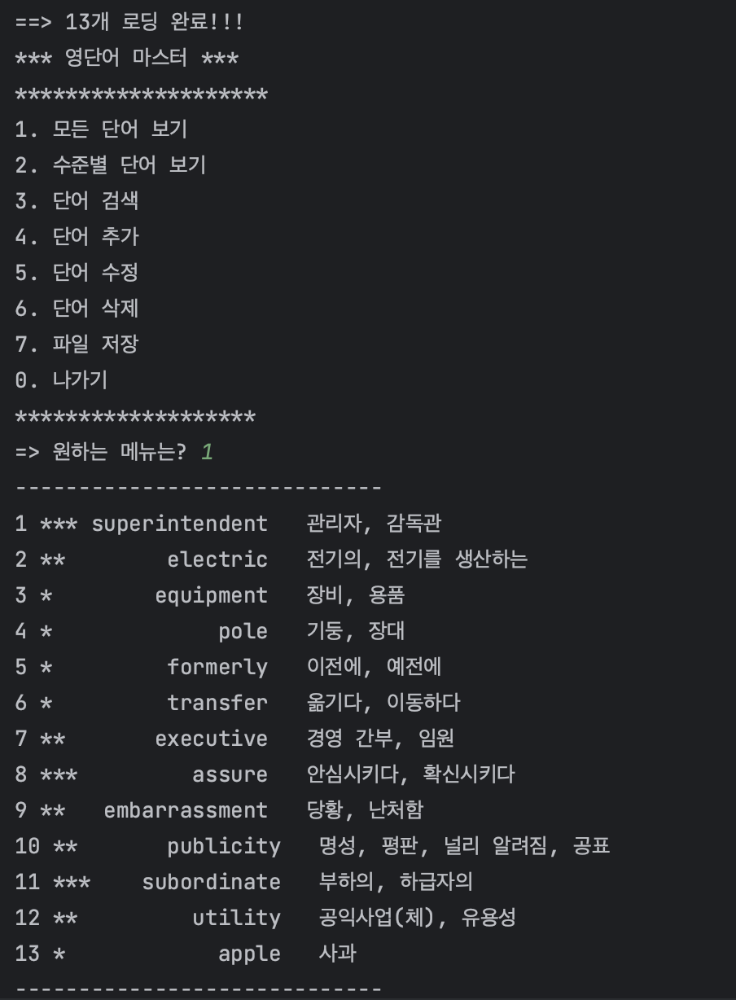
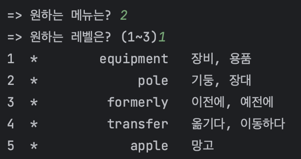
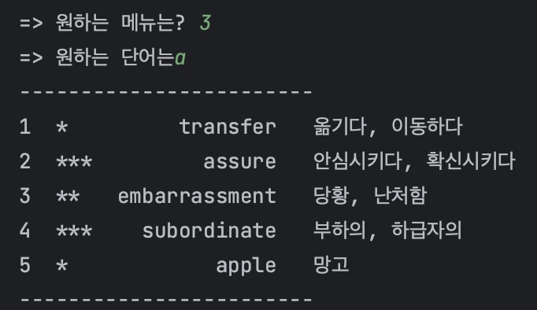
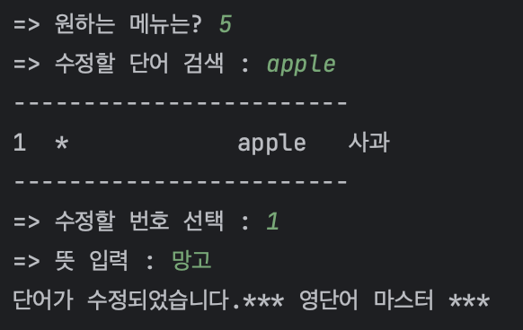
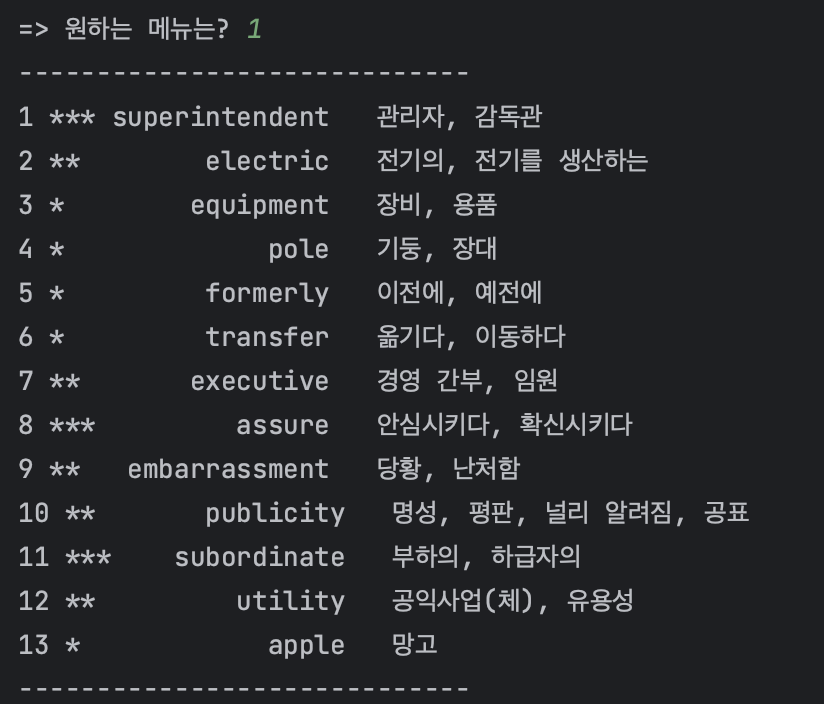
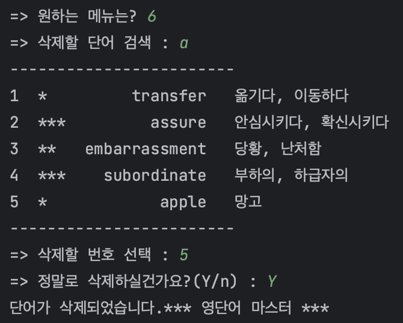
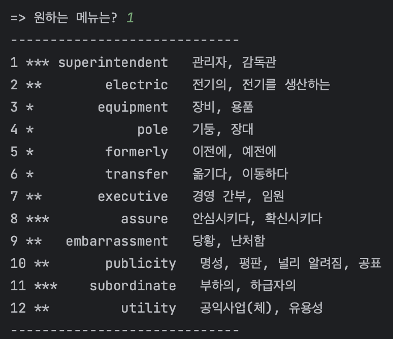
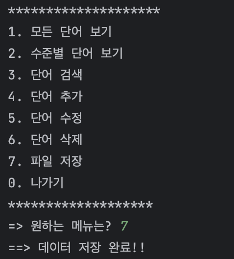

# WordMaster_22000236

### 실행화면

###### 단어 불러오기 & 1. 모든 단어 보기

###### 2. 수준별 단어 보기

###### 3. 단어 검색

###### 4. 단어추가

###### 5. 단어 수정

###### (단어 수정 결과)

###### 6. 단어 삭제

###### (단어 삭제 결과)

###### 7. 파일 저장

###### 0. 나가기

